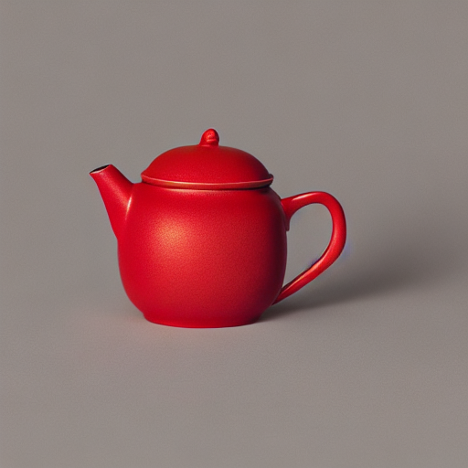
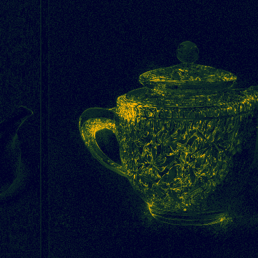

# Stable Diffusion causal influence pilot

**Project:** Poiesis Ansh

**Run date:** 9 October 2026

**Status:** completed pilot with three held-out seed checks

**Scope:** model-component influence, not legal ownership or training-image attribution

## Executive result

The experiment completed every requested track.

- The final float-RGB gradient passed a finite-difference check with 0.53% relative error.
- A trained rank-4 adapter changed held-out images 4.8 times more than its random control.
- Early whole-block patches reduced source-image pixel RMSE in two of three held-out seeds.

The effects were not stable enough to support one model-influence percentage.
Each fitted direction reduced final source-image RMSE in only one of three held-out seeds.

None of these results establishes ownership, authorship, or training-data credit.

## What the earlier numbers measured

The earlier 40.8%, 30.6%, and 28.6% values did not use Stable Diffusion.

They came from a transparent 64×64 categorical generator.
It contained prompt attributes, a sampled model-prior proposal, routing bits, and a visible background state.

The model prior was a smoothed 81-cell distribution learned from 30,000 synthetic scenes.
The experiment enumerated every non-zero state for each condition.
The largest condition contained 559,872 states.

Exact entropy and Shapley calculations then allocated represented output information:

| Toy-system player | Share |
|---|---:|
| Prompt | 40.8% |
| Sampled model-prior proposal | 30.6% |
| Seed and routing | 28.6% |

The Gaussian spectral study used exact information formulas.
The architecture study used small, untrained NumPy networks.

Those studies validated estimators under known mechanisms.
They were not production-model measurements.

## Real-model setup

| Item | Declared value |
|---|---|
| Model | CompVis Stable Diffusion v1.4 |
| Revision | `133a221b8aa7292a167afc5127cb63fb5005638b` |
| Licence | CreativeML OpenRAIL-M |
| Device | Apple MPS |
| Precision | FP32 |
| Scheduler | DDIM, 20 steps, eta 0 |
| Guidance | 7.5 |
| Image | 512×512 |
| Primary seed | 20261009 |

The experiment used one matched prompt contrast.
Only the colour word changed.

- Source: “A red ceramic teapot on the left side, before a striped background, studio photograph.”
- Target: “A blue ceramic teapot on the left side, before a striped background, studio photograph.”

The initial latent, sampler, guidance, and other tokens stayed fixed.

| Source | Target |
|---|---|
|  |  |

The one-word change altered colour, geometry, object count, and background.
The full-image source-target RMSE was 0.2496.
Almost every pixel changed by at least 1% of its channel range.

The prompt change became mixed with the full generation path.
It is not a pure estimate of colour control.

## 1. Weight gradients and output differences

The experiment used two related sensitivity measurements.

First, automatic differentiation measured a declared denoiser objective at step 10.
The scheduler timestep was 451.

The objective was half the mean squared difference between source and target guided-noise predictions.
It used the same target trajectory state.
A deterministic randomized SVD estimated each rank-4 energy value.

Second, central differences measured final-image responses along selected directions.
Each direction was a deterministic, random rank-4 weight delta.
The calculation used 8-bit output images.

| Weight group | Parameters | Local gradient RMS | Rank-4 energy | Finite-difference image RMS | Left | Centre | Right |
|---|---:|---:|---:|---:|---:|---:|---:|
| Down-block cross-attention value | 245,760 | 3.330×10⁻⁵ | 99.41% | 0.01636 | 0.00267 | 0.02630 | 0.01015 |
| Up-block cross-attention value | 983,040 | 1.402×10⁻⁵ | 99.92% | 0.02933 | 0.00530 | 0.04475 | 0.02334 |
| Mid-block cross-attention value | 983,040 | 9.219×10⁻⁶ | 99.83% | 0.01294 | 0.00198 | 0.01856 | 0.01235 |

The tested up-block direction produced the largest finite-difference image response.
All three effects were strongest in the centre region.
That region contained most of the rendered teapot.

The finite-difference estimates used dose steps of 0.25 and 0.125.
Their cosine similarity was 0.935.
Their RMS ratio was 1.213.

The agreement is strong but incomplete.
The selected scale already includes nonlinearity and image quantisation.

The rank-4 energy result is local to one prompt, latent, and timestep.
Single-example linear-layer gradients can be low rank by construction.
It does not prove that the concept has four dimensions.

### Exact final-image scalar gradient

A separate run differentiated the final decoded float-RGB image.
It used 256×256 pixels and eight DDIM steps to keep the full graph in memory.

The objective was half the mean squared difference between source and target images.
The source image stayed fixed during differentiation.

| Weight group | Final-image gradient RMS | Rank-4 energy |
|---|---:|---:|
| Down-block cross-attention value | 0.009798 | 99.90% |
| Up-block cross-attention value | 0.003334 | 99.92% |
| Mid-block cross-attention value | 0.002943 | 99.64% |

The check used an up-block rank-4 descent direction with 0.001% relative norm.
Autograd predicted −0.001349.
The central difference measured −0.001342.
The relative error was 0.53%.

This result is one exact vector-Jacobian product for one scalar image objective.
It is not the complete image Jacobian.
Its scale is not comparable to the 512×512 denoiser-objective gradient.

## 2. Controlled rank-4 weight changes

### Gradient-SVD perturbation

The intervention used `W(alpha) = W + alpha BA`.
This is a LoRA-form rank-4 delta.
It is not a production-trained adapter.

The full delta norm was 1% of the base matrix norm.
The experiment compared a random direction with a gradient-aligned direction.

| Direction and dose | Target-change RMSE | Pixels changed at least 1% | Source restoration |
|---|---:|---:|---:|
| Random, +0.5 | 0.01434 | 10.37% | not optimised |
| Random, +1.0 | 0.02350 | 17.25% | not optimised |
| Gradient-aligned, +0.1 | 0.07595 | 45.67% | 0.34% |
| Gradient-aligned, +0.25 | 0.10124 | 73.97% | 1.71% |
| Gradient-aligned, +0.5 | 0.11496 | 98.82% | 3.29% |
| Gradient-aligned, +1.0 | 0.13598 | 99.78% | 1.43% |

At equal +0.5 dose, the aligned direction changed the image 8.0 times more than the random direction.
This comparison controls rank, matrix, and relative norm.

The one-step objective fell 34.8% at dose +0.1.
It increased again by dose +0.25.
The local descent direction therefore overshot quickly.

The full image did not follow the local denoiser objective exactly.
This difference separates local sensitivity from end-to-end causal effect.

| Base target | Random +1.0 | Gradient-aligned +0.5 |
|---|---|---|
|  |  |  |

The zero-dose images matched the baseline pixel-for-pixel.
The intervention context also restored original weights exactly.

### Trained LoRA adapter

A separate adapter trained both rank-4 factors while the base model stayed fixed.
Training used seed 20261009 and denoising steps 6, 10, and 14.
It used 36 Adam updates.

The trained direction was rescaled to 1% of the base matrix norm.
The random control used the same module, rank, dose, and norm.

At dose +1.0, the three fitting objectives fell by 11.69% to 13.20%.
The final image did not follow this local objective.

| Fitting-seed dose | Target-change RMSE | Source restoration |
|---|---:|---:|
| −1.0 | 0.04200 | 0.28% |
| 0.0 | 0.00000 | 0.00% |
| +0.25 | 0.02160 | −0.04% |
| +0.5 | 0.04303 | −0.06% |
| +1.0 | 0.06599 | −0.63% |

| Held-out direction, dose +0.5 | Mean target-change RMSE | Mean restoration | Positive seeds |
|---|---:|---:|---:|
| Trained rank-4 | 0.02976 | 0.015% | 1/3 |
| Random rank-4 | 0.00618 | 0.046% | 2/3 |

The trained direction changed held-out images 4.8 times more than the random direction.
It did not produce stable source-image restoration.

| Base target | Trained LoRA +0.5 | Random control +0.5 |
|---|---|---|
|  |  |  |

This adapter learned one prompt-pair objective.
It is not a general colour or teapot adapter.

## 3. Internal activation patching

The donor was the red-prompt trajectory.
The recipient was the blue-prompt trajectory.

The patch replaced conditional-branch outputs from one mid-block transformer.
Three denoising windows were tested.

The hook replaced the complete `BasicTransformerBlock` output.
This output contains residual and attention signals.

Restoration was defined as:

\[
1-\frac{d(\text{patched},\text{source})}{d(\text{target},\text{source})}.
\]

Positive values move toward the source image.
Negative values move farther away.

| Patch window | Calls | Target-change RMSE | Full restoration |
|---|---:|---:|---:|
| Identity control | 20 | 0.0000 | 0.00% |
| Early, steps 0–6 | 7 | 0.1956 | 21.68% |
| Middle, steps 7–13 | 7 | 0.1223 | −5.38% |
| Late, steps 14–19 | 6 | 0.0437 | −0.53% |

| Target | Early source patch | Middle source patch | Late source patch |
|---|---|---|---|
|  |  |  |  |

The early patch changed composition and object structure.
It did not simply transfer the colour red.

The patch therefore substitutes a complete trajectory state.
It does not localise colour or cross-attention information.

Early and middle windows used seven calls.
The late window used six calls.
Noise levels and downstream amplification also differed.
The timing comparison is therefore exploratory.

The identity patch reproduced the target exactly.
This control rules out the hook itself as the cause.

## Held-out seed checks

The direction was fitted once with seed 20261009.
Seeds 20261010, 20261011, and 20261012 were held out.
The code did not refit the direction for these seeds.

| Intervention | Mean target-change RMSE | Mean restoration | Restoration range | Positive seeds |
|---|---:|---:|---:|---:|
| Early activation patch | 0.2089 | 16.76% | −3.40% to 27.40% | 2/3 |
| Random rank-4, +1.0 | 0.0249 | −0.02% | −0.68% to 0.44% | 2/3 |
| Gradient-aligned rank-4, +0.5 | 0.1030 | −4.29% | −11.50% to 0.67% | 1/3 |

The early patch reduced source-image RMSE in two held-out seeds.
One seed still moved away from the source.

The gradient-aligned direction changed every image strongly.
It reduced source-image RMSE in only one held-out seed.

This result does not support stable final-image source similarity across seeds.

The experiment also checked the fitted step-10 denoiser objective.

| Aligned dose | Mean objective reduction | Reduction range | Positive seeds |
|---|---:|---:|---:|
| +0.1 | 1.73% | −0.26% to 3.87% | 2/3 |
| +0.5 | −25.80% | −44.53% to 0.55% | 1/3 |

The small dose transferred weakly to two held-out seeds.
The larger dose overshot in two held-out seeds.

Final-image similarity and the local denoiser objective remain different endpoints.

## What the experiment supports

The selected weight directions and whole-block patches have causal effects under declared interventions.
The finite-difference effects were spatially structured.
The unequal patch windows do not establish a timing mechanism.

The results also support four cautions.

1. A local gradient is not a global contribution share.
2. A causal edit is not a stable semantic factor.
3. A whole-state patch measures one artificial substitution, not exclusive representation.
4. Mechanistic influence does not establish legal or moral ownership.

There is no natural “model absent” image for this generator.
Any model-share claim needs a replacement model or another explicit counterfactual.

Fixed model parameters also have zero mutual information as constants.
Their causal necessity does not vanish because that mutual information is zero.

Weight gradients change under equivalent parameterisations.
Component-level shares therefore depend on the selected coordinates and grouping.

## Relation to prior work

The pilot follows several established research lines.

| Research line | Closest result | Relevance here |
|---|---|---|
| Gradient localisation | [Cones](https://proceedings.mlr.press/v202/liu23j.html) | Uses gradient statistics to locate diffusion concepts. |
| Low-rank semantic edits | [Concept Sliders](https://www.ecva.net/papers/eccv_2024/papers_ECCV/html/5660_ECCV_2024_paper.php) | Trains continuous LoRA concept directions. |
| Causal tracing | [Localizing and Editing Knowledge](https://proceedings.iclr.cc/paper_files/paper/2024/file/4bfcebedf7a2967c410b64670f27f904-Paper-Conference.pdf) | Reports distributed U-Net mediation. |
| Attention patching | [Precise Parameter Localization](https://proceedings.iclr.cc/paper_files/paper/2025/hash/add6cccf7ddc718eb6a7991cb531812d-Abstract-Conference.html) | Localises rendered-text control with patches. |
| Attention maps | [DAAM](https://aclanthology.org/2023.acl-long.310/) | Maps prompt tokens to spatial regions. |
| Intervention validation | [Cross-Attention Interventions](https://aclanthology.org/2026.findings-acl.1265/) | Tests attention signals with fixed-seed prompt removal. |
| Weight-space structure | [Interpreting the Weight Space](https://proceedings.neurips.cc/paper_files/paper/2024/hash/f85364507054c257959c2011c28bfc0d-Abstract-Conference.html) | Finds semantic directions across customised models. |
| Training-data counterfactuals | [Outputs Are Often Unattributable](https://www.nature.com/articles/s41467-026-75667-5) | Separates model mechanisms from training-unit attribution. |

This literature supports interventions over attention-only explanations.
It also separates model-component attribution from training-data attribution.

## Limits

This is a causal pilot, not a population study.

- It uses one model and one prompt contrast.
- The robustness set has one fitting seed and three held-out seeds.
- Pixel RMSE can penalise harmless translations.
- Fixed thirds are not object masks.
- Only three weight groups were screened.
- The final-image gradient used 256×256 pixels and eight steps.
- The trained adapter used one module, one prompt pair, and one fitting seed.
- Only one complete transformer-block output was patched.
- The patch windows had unequal lengths.
- The aligned direction used one timestep and one seed.
- No training sample was removed or retrained.

The next full study should add object masks, perceptual metrics, prompt families, and more seeds.
It should also add symmetric patches, unrelated donors, and rank-matched random controls.

Training-data ownership questions require removal or retraining counterfactuals.
These experiments cannot replace that test.

## Reproducibility

The repository stores code, images, tables, raw gradients, and exact hashes.
The model weights remain outside Git.

Key outputs are:

- [`real_model/artifacts/influence_summary.json`](real_model/artifacts/influence_summary.json)
- [`real_model/artifacts/weights/weight_intervention_results.json`](real_model/artifacts/weights/weight_intervention_results.json)
- [`real_model/artifacts/gradient_svd_lora/gradient_aligned_lora_results.json`](real_model/artifacts/gradient_svd_lora/gradient_aligned_lora_results.json)
- [`real_model/artifacts/gradient_svd_lora/aligned_rank4_factors.npz`](real_model/artifacts/gradient_svd_lora/aligned_rank4_factors.npz)
- [`real_model/artifacts/output_weight_gradients/output_weight_gradient_results.json`](real_model/artifacts/output_weight_gradients/output_weight_gradient_results.json)
- [`real_model/artifacts/trained_lora/trained_lora_results.json`](real_model/artifacts/trained_lora/trained_lora_results.json)
- [`real_model/artifacts/patching/activation_patching_results.json`](real_model/artifacts/patching/activation_patching_results.json)
- [`real_model/artifacts/seed_robustness/seed_robustness_results.json`](real_model/artifacts/seed_robustness/seed_robustness_results.json)
- [`real_model/manifests/model_manifest.json`](real_model/manifests/model_manifest.json)

All unit tests pass.
Identity and zero-dose controls are pixel-exact.
