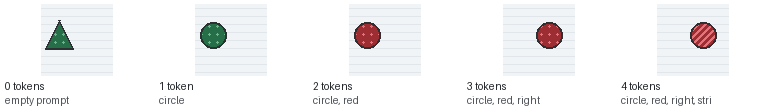
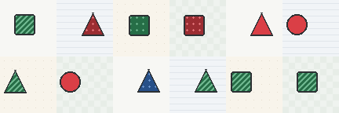

# Prompt, model prior, and randomness in a generated image

## A transparent end-to-end attribution experiment

**Experiment date:** 26 September 2026; corrected and extended 5 October 2026  
**Status:** completed; exact enumeration, deterministic rerun, and internal consistency checks passed  
**Scope:** a deliberately small learned-prior image generator, not a claim about legal ownership or a production diffusion model

## Executive finding

Within this experiment's explicitly defined generator and output representation, increasing prompt specificity transferred measured contribution from the learned model prior to the prompt—but there was no single method-independent “ownership ratio.”

At the two-token midpoint, the exact three-player Shapley allocation was:

| Contributor | Share of represented output information |
|---|---:|
| Prompt | **40.8%** |
| Learned model-prior proposal | **30.6%** |
| Seed and stochastic routing | **28.6%** |

If the seed contribution is excluded, the split is **57.2% prompt / 42.8% model prior**. This percentage uses a different denominator.

Across zero to four specified visual attributes, prompt Shapley share rose monotonically from **0.0% to 61.6%**, while model-prior share fell from **72.6% to 5.6%**. The stochastic contribution remained material because it included both visible microtexture and whether each prompt token successfully overrode the model proposal.

The attention-style proxy was directionally useful but not calibrated as credit. At two tokens, it assigned **44.4%** to prompt routing. Prompt deletion changed only **29.6%** of weighted semantic pixel energy. The mean absolute difference was **14.8 percentage points**.

The defensible conclusion is therefore:

> Prompt contribution can be quantified only relative to a declared population, output representation, player set, intervention, and value function. Attention can help locate influence, but it is not an ownership meter. A legal authorship conclusion does not follow from any of these percentages.

## What was built

The generator makes 64×64 images with four semantic slots:

1. shape: circle, square, or triangle;
2. colour: red, green, or blue;
3. horizontal position: left, centre, or right;
4. texture: solid, stripes, or dots.

A correlated population distribution favours particular combinations. A model prior was learned from **30,000** sampled scenes using a smoothed 81-cell joint frequency table (Dirichlet α = 0.5). Its entropy was **5.304 bits**, and the KL divergence from the population distribution was only **0.00164 bits**, confirming that the learned prior recovered the intended distribution closely.

For each generated scene:

- the **model-prior player** proposes all four attributes from that learned joint distribution;
- the **prompt player** specifies between zero and four attribute values;
- an **attention-style routing gate** decides if a specified token overrides the model proposal;
- the **seed/stochastic player** supplies four independent routing bits and one visible background state.

The routing bits remain independent of the prompt mask. This correction prevents the seed from encoding prompt information.

The progressive example below holds the prior proposal and visible seed fixed while adding prompt attributes.



The learned prior itself generates a visibly non-uniform family of scenes:



## The mathematical estimands

### 1. Mutual-information decomposition

For discrete variable \(V\), Shannon entropy is

\[
H(V)=-\sum_v p(v)\log_2 p(v).
\]

For source \(S\) and output \(X\),

\[
I(S;X)=H(X)-H(X\mid S).
\]

The chain rule gives, in the chosen order,

\[
I(P,M,Z;X)=I(P;X)+I(M;X\mid P)+I(Z;X\mid P,M).
\]

Here \(X\) is exactly determined by prompt \(P\), model-prior proposal \(M\), and stochastic state \(Z\), so \(I(P,M,Z;X)=H(X)\). This makes the chain terms add to the represented output entropy.

The order matters: redundant or synergistic information is credited differently when sources are reordered. The chain rule is an identity, not a neutral ownership rule.

There is also a crucial correction to the motivating proposal. In a normal generation run, trained parameters \(\theta\) are fixed. A fixed constant has zero mutual information, so \(I(\theta;X\mid P)=0\). This experiment therefore does **not** relabel a fixed parameter tensor as a random variable. It operationalises “model prior” as the model's random scene proposal \(M\). A real experiment about weights would need an explicitly sampled ensemble of models or checkpoints.

### 2. Shapley allocation

The cooperative game uses three players \(N=\{P,M,Z\}\) and value

\[
v(S)=I(S;X).
\]

For player \(i\), the exact Shapley value is

\[
\phi_i=\sum_{S\subseteq N\setminus\{i\}}
\frac{|S|!(|N|-|S|-1)!}{|N|!}
\left[v(S\cup\{i\})-v(S)\right].
\]

With three players, all eight coalitions are tractable. Shapley averaging removes the arbitrary source order and satisfies efficiency, so the three values sum to \(H(X)\). It still depends on the chosen players, coalition semantics, output representation, and utility.

### 3. Attention-style routing and causal ablation

For semantic slot \(j\), a prompt token receives gate mass \(q_j\) when present and zero when absent. Each slot is weighted by its average pixel effect \(e_j\), measured by exhaustively changing that attribute in the renderer. The descriptive attention share is

\[
A_P=\mathbb{E}\left[\sum_j e_j q_j\mathbf{1}\{j\text{ specified}\}\right],
\quad \sum_j e_j=1.
\]

The causal comparison deletes every prompt token while holding the model proposal and seed fixed, then measures the changed renderer-weighted semantic energy. A prompt token can receive high attention yet cause no change when it agrees with what the model prior would already have produced. That is precisely why attention mass exceeded ablation effect here.

Raw cross-attention mass must also not be divided by self-attention mass in a real diffusion network: the two modules are separately normalised over different keys, heads, layers, and spatial resolutions. Self-attention is not synonymous with “the model prior.”

## Main results

All probabilities below use exact enumeration. The largest condition contained 559,872 non-zero source states.

| Prompt attributes specified | Output entropy (bits) | Prompt Shapley | Model-prior Shapley | Seed/stochastic Shapley | Prompt among P+M | Attention prompt share | Causal prompt pixel change |
|---:|---:|---:|---:|---:|---:|---:|---:|
| 0 | 7.304 | 0.0% | 72.6% | 27.4% | 0.0% | 0.0% | 0.0% |
| 1 | 8.002 | 25.3% | 47.5% | 27.3% | 34.7% | 22.2% | 14.8% |
| 2 | 8.272 | **40.8%** | **30.6%** | **28.6%** | **57.2%** | **44.4%** | **29.6%** |
| 3 | 8.335 | 52.5% | 17.0% | 30.5% | 75.6% | 66.6% | 44.4% |
| 4 | 8.340 | 61.6% | 5.6% | 32.7% | 91.6% | 88.8% | 59.2% |

Two patterns matter.

First, output entropy increased with prompt specificity. Uniformly sampled user values counteracted the learned prior's correlations, making the output population more diverse. A percentage can therefore rise because the numerator changes, the denominator changes, or both.

Second, the seed share is not negligible. More specified tokens create more stochastic routing decisions, so “same model + same prompt” is still not a deterministic authorship object unless the seed and sampler are explicitly conditioned on or allocated.

## Guidance-strength sensitivity

Holding the prompt at exactly two attributes while changing only its probability of overriding the model produced:

| Guidance condition | Mean token routing probability | Prompt Shapley | Model-prior Shapley | Seed/stochastic Shapley | Attention share | Causal pixel change |
|---|---:|---:|---:|---:|---:|---:|
| Weak | 0.600 | 25.9% | 40.1% | 33.9% | 30.0% | 20.0% |
| Base | 0.885 | 40.8% | 30.6% | 28.6% | 44.4% | 29.6% |
| Strong | 0.975 | 46.6% | 27.8% | 25.5% | 48.8% | 32.5% |

Prompt length alone does not measure control. Two clauses received between **25.9% and 46.6%** of total Shapley credit.

## Closed-form stress test: redundancy and synergy

A second 256-state benchmark was included to expose a failure that the visual experiment alone could hide. It uses independent bits and constructs six output bits:

- one uniquely supplied by the prompt;
- one uniquely supplied by the model-prior state;
- one redundantly present in both;
- two obtainable only from prompt×model interactions;
- one supplied by noise.

The output entropy is exactly 6 bits.

The prompt-first chain rule gives **2 prompt bits, 3 model-given-prompt bits, and 1 noise bit**. Reversing the first two sources gives **2 model bits, 3 prompt-given-model bits, and 1 noise bit**. The same system therefore yields “33.3% first source / 50.0% second source” in either ordering: the conditional split allocates interaction information to whichever source arrives second.

A factor-wise Williams–Beer \(I_{min}\) partial-information decomposition recovered the constructed atoms exactly:

| Information atom | Bits |
|---|---:|
| Prompt-unique | 1.0 |
| Model-unique | 1.0 |
| Redundant | 1.0 |
| Synergistic | 2.0 |
| Seed/noise | 1.0 |

Exact Shapley averaging split redundancy and synergy symmetrically: **2.5 bits prompt, 2.5 bits model prior, and 1 bit noise**, or **41.7% / 41.7% / 16.7%**. Reconstruction and efficiency residuals were zero.

This does not make Shapley metaphysically correct; it makes the normative rule visible. Here the rule is “average marginal contribution over all arrival orders,” which divides shared and interactive value equally between symmetric players.

## Validation and reproducibility

- Exact Shapley efficiency error: at most \(1.78\times10^{-15}\) bits in the visual experiment; exactly zero in the stress test.
- PID reconstruction error: zero bits.
- Learned-prior fit: KL(true || learned) = 0.00164 bits.
- Attention versus prompt/model Shapley trend: Pearson 0.987; Spearman 1.000 across five specificity levels.
- Attention versus causal prompt-change trend: Pearson 1.000; Spearman 1.000, but mean absolute calibration error 0.148.
- Results file SHA-256: `2a01dd8f740ff1a0dac3ce7db4455955b69c08bf13cba90e4596db0f45f1ddfe`.

Rerun from this directory with:

```bash
/Users/evam/.cache/codex-runtimes/codex-primary-runtime/dependencies/python/bin/python3 experiment.py
```

The run is deterministic under seed `20260926`. The script regenerates all CSV, JSON, checksum, and PNG artifacts.

The extended robustness study is in [`CRITIQUE_AND_RD.md`](CRITIQUE_AND_RD.md). It tests representation, denominator, prior, prompt population, and sample size.

## What this experiment establishes

It establishes, in a setting with known sources, that:

1. prompt influence increases with realised control, not merely with word count;
2. conditional-MI decompositions are order-sensitive in the presence of redundancy or synergy;
3. Shapley values turn that ambiguity into an explicit allocation convention and satisfy an auditable efficiency check;
4. the routing proxy tracks prompt influence but does not measure causal or economic credit;
5. randomness is a third contributor that cannot safely be folded into “the model” without saying so.

## What it does not establish

This is a benchmark of estimators, not a measurement of a commercial model's ownership split.

- A sampled prior proposal is not the same object as fixed weights \(\theta\), architecture, optimiser, or any training example.
- Discrete semantic codes avoid the pathologies of raw continuous-pixel MI, but the answer depends on that representation.
- The prompt distribution was uniform by design. Changing the population changes mutual information.
- Shapley values depend on a chosen utility and on meaningful counterfactual coalitions. A true “prompt without a model” cannot generate an image, so real-model coalitions require normative baselines.
- The attention gate is intentionally inspectable. Production diffusion attention spans many layers, heads, timesteps, tokenisations, and classifier-free guidance branches.
- Pixel metrics overweight large regions and nuisance changes. Semantic metrics introduce their own model and bias.
- No human-judgment calibration was performed.
- No percentage here is a legal threshold or a finding of authorship, copyrightability, co-authorship, liability, or compensation.

The U.S. Copyright Office's January 2025 report says that prompts alone, for then-available systems, generally did not provide sufficient human control over expressive elements; it applies ordinary human-authorship principles case by case and supplies no numerical threshold. A statistical attribution ratio cannot replace that legal analysis.

## Recommended real-diffusion follow-up

A credible next experiment should use a fully open, fixed text-to-image model and report “prompt-conditioning sensitivity” rather than ownership:

1. choose 3–4 independently removable prompt clauses and 16–32 paired seeds;
2. generate every prompt coalition at null, low, standard, and high guidance while holding sampler settings fixed;
3. measure semantic adherence with CLIPScore plus TIFA or GenEval, and perceptual change with LPIPS;
4. compute exact clause-level Shapley values over all coalitions;
5. aggregate DAAM token-region maps and validate them with matched token ablation/replacement;
6. bootstrap across seeds and report confidence intervals, failure cases, and metric disagreement;
7. keep training-data provenance as a separate study rather than calling a model-prior score a data-owner score.

That study would be more realistic, but it would still measure a declared form of control or sensitivity—not legal ownership.

## Primary references

- T. Cover and J. Thomas, *Elements of Information Theory*, Chapter 2, 2005: <https://onlinelibrary.wiley.com/doi/10.1002/047174882X.ch2>
- P. Williams and R. Beer, “Nonnegative Decomposition of Multivariate Information,” 2010: <https://arxiv.org/abs/1004.2515>
- L. Shapley, “A Value for n-Person Games,” 1953: <https://doi.org/10.1515/9781400881970-018>
- A. Ghorbani and J. Zou, “Data Shapley,” ICML 2019: <https://proceedings.mlr.press/v97/ghorbani19c.html>
- R. Rombach et al., “High-Resolution Image Synthesis with Latent Diffusion Models,” CVPR 2022: <https://openaccess.thecvf.com/content/CVPR2022/html/Rombach_High-Resolution_Image_Synthesis_With_Latent_Diffusion_Models_CVPR_2022_paper.html>
- A. Hertz et al., “Prompt-to-Prompt Image Editing with Cross-Attention Control,” ICLR 2023: <https://arxiv.org/abs/2208.01626>
- R. Tang et al., “What the DAAM: Interpreting Stable Diffusion Using Cross Attention,” ACL 2023: <https://aclanthology.org/2023.acl-long.310/>
- S. Jain and B. Wallace, “Attention is not Explanation,” NAACL 2019: <https://aclanthology.org/N19-1357/>
- S. Wiegreffe and Y. Pinter, “Attention is not not Explanation,” EMNLP 2019: <https://arxiv.org/abs/1908.04626>
- J. Ho and T. Salimans, “Classifier-Free Diffusion Guidance,” 2022: <https://arxiv.org/abs/2207.12598>
- U.S. Copyright Office, *Copyright and Artificial Intelligence, Part 2: Copyrightability*, 29 January 2025: <https://www.copyright.gov/ai/Copyright-and-Artificial-Intelligence-Part-2-Copyrightability-Report.pdf>
- Z. Dai and D. Gifford, “Outputs of generative diffusion models are often unattributable,” *Nature Communications*, 2026: <https://www.nature.com/articles/s41467-026-75667-5>
- M. Maliha and D. Hougen, “Mechanistic Interpretability of Text-to-Image Diffusion Models via Cross-Attention Interventions,” *Findings of ACL*, 2026: <https://aclanthology.org/2026.findings-acl.1265/>

## Artifact index

- `experiment.py` — generator, exact enumeration, estimators, validation, and rendering
- `robustness.py` — representation, denominator, prior, population, and sample-size tests
- `CRITIQUE_AND_RD.md` — critical review and research plan
- `artifacts/results.json` — full machine-readable results
- `artifacts/results.csv` — prompt-specificity results
- `artifacts/guidance_sensitivity.csv` — guidance sweep
- `artifacts/learned_prior.csv` — all 81 learned prior cells
- `artifacts/progressive_prompt_examples.png` — controlled visual sequence
- `artifacts/learned_prior_samples.png` — model-prior samples
- `artifacts/results.sha256` — reproducibility checksum
- `artifacts/robustness_results.json` — machine-readable robustness results
- `artifacts/robustness_results.sha256` — robustness checksum
